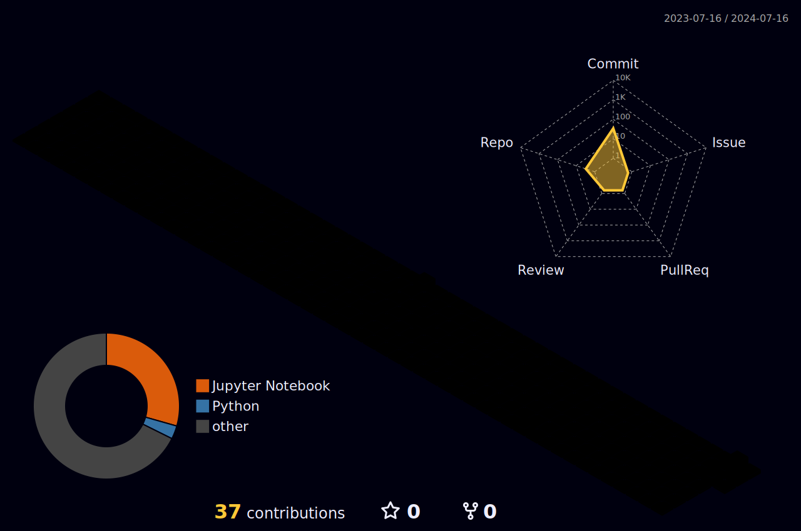

<h1 align="center">Hi 👋, I'm Chandan Raj C L</h1>
<h3 align="center">A passionate FullStack Data Scientist </h3>

- 💬 Ask me about **ML,DL,CV,AI,LLM**

- 🌱 I’m currently learning **MLOps, CI / CD**  

- 📫 How to reach me **chandanrajcl10@gmail.com**

- ⚡ Fun fact **Curiosity Driven**

<h3 align="left">Connect with me:</h3>

# 💻 Tech Stack:
                    
# 📊 GitHub Stats:
 
 

### ✍️ Dev Quote

